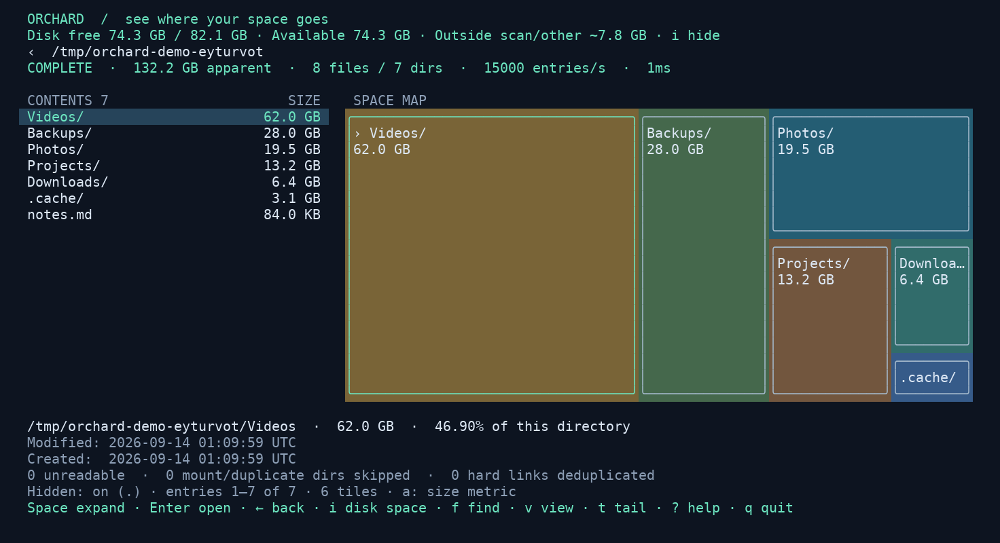

# Orchard

A fast, visual disk-usage explorer for your terminal. Works on **Linux, macOS, and Raspberry Pi OS**.

```sh
curl -fsSL https://raw.githubusercontent.com/ob1rao/orchard/main/install.sh | sh
```

No GitHub login, Go compiler, or sudo needed. On Linux, including Raspberry Pi OS,
the installer saves the install directory in your Bash, Zsh, or POSIX shell startup
files so future shell sessions can run `orchard`. For the current terminal, run
the `export PATH=...` command printed by the installer, or start it directly with:

```sh
"$HOME/.local/bin/orchard"
```


*Actual TUI with sparse demo files at apparent sizes; disk capacity reflects the host filesystem.*

## Explore your storage

Select a disk and watch the treemap fill as Orchard scans. Bigger tiles mean more space used. Open a directory to see what's inside—Scans and file viewing are read-only.

- Browse files and sizes with the keyboard or mouse.
- Use `orchard --unmounted` to select and mount an unmounted volume read-only.
- Search across the disk using plain text or regex.
- See disk free space and an estimate of usage outside the scan.
- View modified and created dates when available.
- Show or hide dotfiles; they're included by default.

To scan a particular folder:

```sh
"$HOME/.local/bin/orchard" "$HOME/Downloads"
```

## Essential controls

| Action | Control |
| --- | --- |
| Select / scroll | ↑ ↓ or mouse wheel |
| Show unmounted volumes in disk picker | u |
| Open directory | Enter or double-click |
| Expand map / page smaller entries | Space; b goes back |
| Go back | Backspace or right-click |
| Search the disk | f or Ctrl-F; Tab toggles regex |
| View selected file / start at end | v / t |
| Filter this directory | / |
| Show / hide dotfiles | . |
| Show / hide disk-space summary | i |
| Help / quit | ? / q |

If `~/.local/bin` is on your PATH, you can simply run `orchard`.
To update, rerun the install command above.

[Full user guide](docs/reference.md) · [Development](docs/development.md) · [Releases](https://github.com/ob1rao/orchard/releases)
